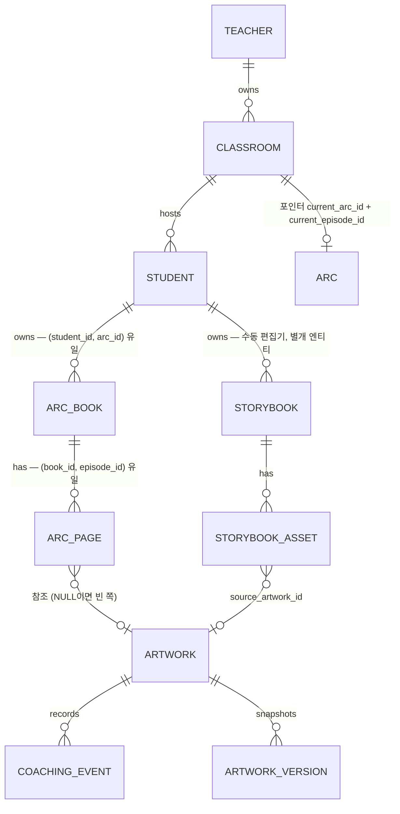
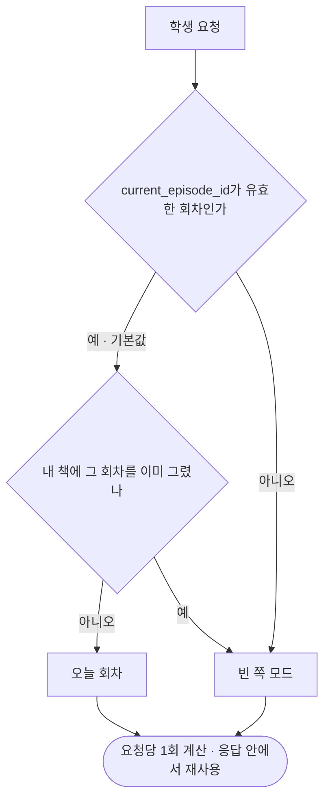
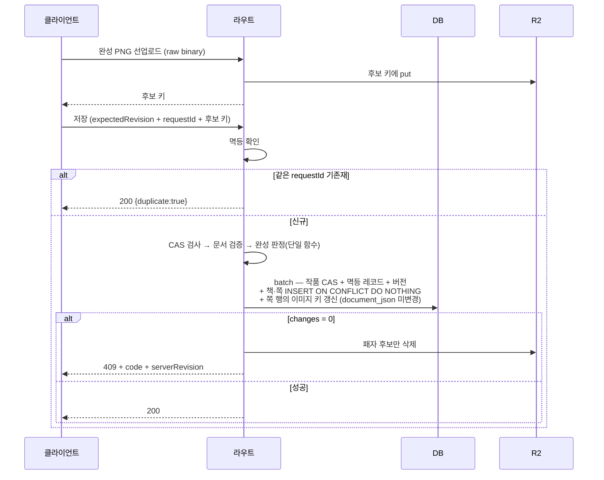

# Architecture Spine — Wiggle Web 이야기 아크

## Design Paradigm

**라우트 = 트랜잭션 스크립트, 저장소 = 포트·어댑터, 동시성 = 낙관적 CAS.**

| 층 | 위치 | 책임 |
|---|---|---|
| 트랜잭션 스크립트 | `app/api/**/route.ts` | 요청 하나를 처음부터 끝까지 |
| 순수 도메인·검증 | `lib/`의 무의존 모듈 (`drawing-model` `save-transmit` `client-ip` `lesson-step-progress` 등) | 모델·검증·계산. 클라이언트와 서버가 같은 모듈을 import |
| 데이터 바인딩 | `db/runtime.ts` | D1 호환 인터페이스 위의 raw SQL |
| 저장소 포트 | `db/adapters/*` | S3(R2) / FS / Prefixed 어댑터 |
| 환경 경계 | `lib/runtime/*` | 환경 판별과 자원 게이트 |

ORM 계층은 **없다.** `db/schema.ts`는 선언·`drizzle-kit generate`용이며 런타임은 쓰지 않는다.
`middleware.ts` / `proxy.ts`를 두지 않는다 — 인증·권한은 라우트가 직접 한다(AD-4).

---

## Architecture Decisions

### 비준 — 이미 코드가 정한 것

**AD-1 데이터 접근은 raw SQL** `[ADOPTED]`
- **Binds** 모든 DB 접근
- **Prevents** ORM 쿼리빌더와 raw SQL이 뒤섞여 트랜잭션·CAS 의미가 갈리는 것
- **Rule** `bindings().DB.prepare(sql).bind(...)` 또는 `.batch([...])`만 쓴다.
  SELECT는 `snake_case AS camelCase` 별칭으로 카멜케이스 행을 만든다. Drizzle 쿼리빌더 사용 금지.

**AD-2 스키마는 자가 프로비저닝, 양쪽 등록** `[ADOPTED]`
- **Binds** 모든 신규 테이블·컬럼
- **Prevents** 한쪽만 반영되어 운영에서 테이블이 없거나 타입 이력이 끊기는 것
- **Rule** 마이그레이션 러너가 없다. 신규 테이블·컬럼은 `db/runtime.ts`의 `schemaStatements`와
  `db/schema.ts` **양쪽에** 넣는다.
  **이미 존재하는 테이블에 컬럼을 더할 때는 `provisionSchema()`에 PRAGMA 확인 + 조건부 `ALTER` 분기를
  반드시 새로 추가한다** — `CREATE TABLE IF NOT EXISTS`는 기존 테이블에 무시되므로,
  분기를 빠뜨리면 로컬·테스트는 통과하고 **운영만 `no such column`으로 500이 난다.**
  새 컬럼은 항상 안전한 기본값을 갖는다. 파괴적 변경 금지 —
  기존 `ensureArtworkMutationPrimaryKey()`의 `DROP TABLE`은 이력상의 예외이며 선례가 아니다.

**AD-3 동시성은 낙관적 CAS + requestId 멱등** `[ADOPTED, 확장]`
- **Binds** 상태를 바꾸는 모든 라우트
- **Prevents** 공용 태블릿·오프라인 큐 환경에서 잃어버린 갱신과 중복 적용
- **Rule** `expectedRevision`을 받아 `UPDATE ... WHERE revision = ?`로 쓰고 `meta.changes`를 검사한다.
  batch의 후속 문장은 `WHERE EXISTS (... last_mutation_id = requestId)`로 앞 문장 성공에 스스로를 건다.
  `(주체, 자원, request_id)` 멱등 레코드를 남기고 재요청은 `{duplicate:true}`로 답한다.
  불일치는 409 + `code` + `serverRevision`이며 **서버가 자동 병합하지 않는다.** 락 금지.
  - **생성도 상태 변경이다.** `meta.changes` 검사 의무는 `INSERT ... ON CONFLICT DO NOTHING`에도 적용한다.
    경합에서 진 요청은 409를 내지 않고 **이미 존재하는 행을 그대로 이어 쓴다.**
  - **한 batch가 두 애그리게이트를 쓰지 않는다.** 클라이언트가 revision을 들 수 없는 엔티티의
    문서 전체를 다른 엔티티의 저장 경로에서 쓰지 않는다.
  - **예외(비준)**: 코칭 이벤트의 멱등 키는 클라이언트 `eventId`(= `coaching_events.id`)이며
    별도 `*_mutations` 테이블을 두지 않는다. 이 예외를 다른 자원으로 확장하지 않는다.

**AD-4 권한은 라우트별 SQL WHERE** `[ADOPTED]`
- **Binds** 모든 데이터 접근
- **Prevents** 권한 미들웨어를 믿고 WHERE를 빠뜨려 남의 데이터가 새는 것
- **Rule** 학생 경로는 항상 `student_id = ?`, 교사 경로는 항상
  `JOIN classrooms c ... AND c.teacher_id = ? AND c.active = 1`을 쿼리에 직접 넣는다.
  수업 코드·join token은 **입장 수단일 뿐 접근 권한이 아니다** — 어떤 읽기 쿼리의 권한 조건도 될 수 없다.

**AD-5 검증은 순수 모듈, 실패는 null, 통과는 정규화 사본** `[ADOPTED]`
- **Binds** 모든 외부 입력
- **Prevents** 검증을 통과한 원본이 그대로 저장되어 크기·필드 보증이 깨지는 것
- **Rule** 검증 함수는 의존성 0 모듈에 두고 실패 시 `null`을 반환한다.
  통과 시 원본이 아니라 **알려진 필드만 남긴 정규화 사본**을 반환한다.
  상한 상수는 클라이언트와 서버가 같은 모듈에서 import한다 — 한쪽만 넓히면 저장이 영구 실패한다.

**AD-6 저장소는 포트·어댑터, 공개 URL 금지, 완성 키는 지우지 않는다** `[ADOPTED, 확장]`
- **Binds** 모든 이미지·파일
- **Prevents** 키를 아는 사람이 남의 작품을 여는 것, 그리고 참조가 살아 있는 객체가 지워지는 것
- **Rule** R2 object에 공개 URL을 만들지 않는다. 읽기는 항상 세션을 검사한 API가 프록시한다.
  키는 `students/<studentId>/...` 프리픽스와 `assertSafeKey()`로 강제하고,
  쓰기는 후보 키 선업로드 → DB CAS 성공 시에만 채택 → **패자 후보만** 보상 삭제한다.
  - **채택된 완성 이미지 키는 저장 경로에서 삭제하지 않는다.**
    현재 `PUT /api/artworks/[id]` 말미의 `artwork.finalImageKey` 삭제는 AD-11이 재완성을 허용하는
    순간 **`storybook_assets.object_key`가 가리키는 객체를 지운다**(그 컬럼은 채택 당시 키의 스냅샷이다).
    이전 키는 누적하고 회수는 정리 작업(Deferred)의 몫이다.

**AD-7 오류·응답 의미론** `[ADOPTED]`
- **Binds** 모든 라우트의 응답
- **Prevents** 클라이언트가 라우트마다 다른 모양을 분기해야 하는 것
- **Rule** 응답은 `noStoreJson` / `jsonError`만 쓴다.
  오류 메시지는 **아이가 읽는 한국어 존댓말**이고, 클라이언트가 분기해야 하면 `code`를 함께 준다.
  스택트레이스·내부 정보를 노출하지 않는다.

### 신규 — 아크가 요구하는 것

**AD-8 아크 콘텐츠는 코드, 회차는 안정 id로 가리킨다**
- **Binds** 아크·회차 정의의 저장 위치와 참조 방식
- **Prevents** 콘텐츠를 고쳤을 때 이미 만들어진 아이 책이 깨지는 것
- **Rule** 회차 장면 정의는 `lib/`의 코드 상수로 둔다. DB에는 **아크 id와 콘텐츠 버전만** 기록한다.
  - 회차는 **순서 index가 아니라 안정적인 `episodeId`** 로 가리킨다.
    버전을 올릴 때 기존 `episodeId`를 **재사용하거나 삭제하지 않는다**(회차 추가·재배열은 허용).
  - 회차 상수 읽기는 **언제나 그 아이 책의 `arcVersion`으로** 한다.
    현재 버전으로 읽는 경로를 만들지 않는다.
  - 아이 책 버전에 오늘의 `episodeId`가 없으면 **그 아이에게 오늘 회차는 없다**(빈 쪽 모드).
  - 아크 상수 모듈은 회차 정의의 체크섬을 함께 내보내고, 불일치 시 실패하는 테스트를 둔다 —
    버전 올림을 잊으면 CI가 잡는다.

**AD-9 학급은 가리키고, 아이는 책을 소유한다**
- **Binds** 아크·회차·책의 소유 관계 전부
- **Prevents** 교사가 아크를 바꿀 때 아이 작업이 사라지거나, 반 진도와 개인 진도가 한 값에 뭉개지는 것
- **Rule** 학급은 포인터**만** 갖는다 — 아이의 작업을 소유하지 않는다.
  - 포인터는 `classrooms`의 **신규 컬럼 `current_arc_id` + `current_episode_id`**에 둔다.
    `current_activity` 문자열 키 문법(`free` | `lesson:<slug>`)을 확장하지 않는다 —
    `normalizeActivityKey`는 **닫힌 허용목록 + 조용한 폴백**이라 모르는 키를 오류 없이
    `DEFAULT_ACTIVITY_KEY`로 바꿔 읽는다. 그 폴백은 FR-15와 같은 변경에서 제거한다
    (`DEFAULT_ACTIVITY_KEY`·`ACTIVITY_KEYS`·`activityLabel()`이 모두 `LESSONS[0]`을 참조한다).
  - 아이는 `(student_id, arc_id)`마다 **책 하나**를 소유하고, 책이 회차별 쪽을 갖는다.
  - 교사가 아크를 바꾸면 새 `(student, arc)` 책이 생기고 **이전 책은 그대로 남는다.**
  - **책과 쪽 행은 아이가 그 아크에서 처음 저장할 때** 같은 batch 안에서
    `INSERT ... ON CONFLICT DO NOTHING`으로 생기고, 쪽은 그 `arcVersion`의 회차 수만큼 한꺼번에 만들어진다.
    빈 쪽 = `source_artwork_id IS NULL`.

**AD-10 회차 귀속은 작품 생성 시점에 고정된다**
- **Binds** 그림이 어느 책 어느 쪽에 속하는지 결정하는 모든 경로
- **Prevents** 오프라인 큐가 며칠 뒤 flush될 때 그림이 엉뚱한 회차에 꽂히는 것
- **Rule** 작품 행이 `arc_id` + `episode_id`를 직접 갖는다(`artworks.lesson_slug` 자리를 승계).
  **어떤 쓰기도 요청 시점의 학급 포인터로 쪽을 재결정하지 않는다.**
  회차의 그림은 **쪽 행이 유일하게 결정**한다 — 그림에서 회차를 역추적하는
  `latest by updated_at` 류의 조회를 만들지 않는다.

**AD-11 아크 책과 수동 그림책은 다른 엔티티다**
- **Binds** 아크 책·쪽의 저장 구조
- **Prevents** 하나의 저장 문서에 두 개의 CAS 주인이 생기는 것
- **Rule** 아크 책은 **신규 테이블**(책 · 쪽)이며 기존 `storybooks`/`storybook_assets`
  (자유 레이아웃 편집기)와 **다른 엔티티**다. `storybooks`에 `arc_id`를 얹지 않는다.
  - 쪽의 그림 참조·이미지 키는 **쪽 행의 컬럼**이며 `document_json` 안에 넣지 않는다.
    그래서 회차 저장이 아이 소유 레이아웃 문서를 건드리지 않고, `storybooks.revision`을 올리지 않는다.
  - 회차 쪽의 순서는 아크가 정하며 **이동할 수 없다.** 순서 이동은 수동 편집기의 기능이다.
  - 한 그림이 아크 쪽과 수동 그림책 양쪽에서 참조될 수 있다 —
    완성 이미지 키가 바뀌면 **참조하는 모든 종류의 쪽**을 갱신한다.
  - 쪽 → 책은 `ON DELETE CASCADE`. **쪽의 그림 참조에 `ON DELETE SET NULL`을 쓰지 않는다** —
    유실이 빈 쪽으로 위장되면 결석(부재)과 손상을 구분할 수 없게 된다(AD-15).

**AD-12 책 쪽은 그림을 참조한다 — 복사하지 않는다**
- **Binds** 회차 그림과 쪽의 관계
- **Prevents** 아이가 고친 그림과 책 속 그림이 갈라지는 것
- **Rule** 쪽은 그림의 현재 이미지를 참조한다. 그림이 다시 완성되면 그 쪽의 이미지 키를 갱신한다.
  원본 자산은 불변이고 크기·위치·회전은 쪽이 따로 갖는다.
  **재계산은 아이가 정한 회전·정렬을 보존하고, 새 자연 비율로 지정 영역 안에 다시 맞추는 것만 한다.**

**AD-13 완성은 잠금이 아니라 되돌릴 수 있는 상태다**
- **Binds** `artworks.status === 'complete'`를 검사하는 모든 경로
- **Prevents** 아이가 자기 그림을 못 고치는 것, 그리고 라우트마다 완성 상태를 달리 해석하는 것
- **Rule** 완성 판정은 `lib/`의 **단일 조건 함수**이며, 세 검사 지점이 그것을 import한다 —
  작품 저장 `PUT /api/artworks/[id]`, 완성 이미지 선업로드 `PUT /api/artworks/[id]/image`,
  코칭 `recordCoachingBefore`. 라우트마다 따로 읽지 않는다.
  - 재개봉은 `PUT /api/artworks/[id]`의 `reopen` 필드 **하나로만** 일어난다. 새 최상위 라우트를 만들지 않는다.
  - **재개봉과 그 뒤의 저장은 서로 다른 `requestId`를 쓴다** —
    같은 값을 쓰면 `artwork_mutations`의 복합 PK가 두 번째 호출을 `{duplicate:true}`로 삼켜
    실제 저장이 조용히 버려진다.
  - ⚠️ 지금 완성 상태는 세 라우트에서 네 가지로 해석된다(`ARTWORK_COMPLETE`+revision /
    `ARTWORK_COMPLETE`만 / `code` 없는 맨 409 / `REVISION_CONFLICT`로 매핑).
    **통일은 보존된 불변식이 아니라 해야 할 일이다.**

**AD-14 접속 맥락은 파생값이며 기본값은 교실이다**
- **Binds** 교실/집 판별과 그에 따라 무엇을 여는가
- **Prevents** 교사 조작을 기다리며 수업이 멈추는 것(FR-33), 아이 위치가 데이터로 남는 것
- **Rule** 판별 신호는 **`classrooms.current_episode_id`가 유효한 회차를 가리키는가** 하나다.
  `admission_open`·`active`·`teacher_views`·`starts_at`/`ends_at`는 판별 근거가 아니다.
  - **기본값은 교실이다.** 포인터가 유효하면 오늘 회차를 연다.
    빈 쪽 모드는 포인터가 없거나, 아이가 이미 그 회차를 그렸거나, 아이가 명시적으로 고를 때만 열린다.
    교사가 아무것도 누르지 않아도 흐름이 막히지 않는다.
  - 판별은 **요청당 한 번** `lib/`의 무의존 함수로 계산하고 **응답 안에서 재사용한다** —
    화면과 열기 경로가 각자 계산하지 않는다.
  - 어디서 접속했는지를 저장하지 않는다. IP는 rate limit 버킷 키로만 쓰며
    프로필·작품·코칭 이벤트 어디에도 남기지 않는다(`rate_limits.key`의 평문은 창 종료 시 청소된다 —
    이 수명을 늘리거나 키를 다른 테이블로 옮기지 않는다).

**AD-15 빈 쪽은 응답 형상으로 강제한다**
- **Binds** 빈 쪽을 실어 나르는 모든 응답 타입
- **Prevents** 결석이 미완료 지표로 새어나가 점수·순위 금지 원칙을 우회하는 것
- **Rule** 빈 쪽은 쪽 목록의 `artworkId: null`로**만** 표현된다.
  - 학생·교사 응답 타입에 `completedCount` `missingCount` `progressRate` `completionRate` 류의
    **집계 필드를 정의하지 않는다.** 서버는 정렬 키를 주지 않는다. 없는 필드는 UI가 쓸 수 없다.
  - 교사에게 노출되는 것은 **학급 포인터**(반이 어느 회차까지 왔는가)와,
    한 아이를 열었을 때의 **쪽 목록**뿐이다. 학급 목록 화면 응답에는 빈 쪽 수·비율·정렬 키를 두지 않는다.
    → FR-34(개별 확인 가능)와 FR-10b(목록에서 낙인 없음)가 동시에 성립한다.
  - 빈 쪽은 **참조가 한 번도 없었던 쪽**만을 뜻한다. 그림 참조를 사후에 NULL로 되돌리는 경로를 만들지 않는다.

**AD-16 그리미의 두 모드는 아이의 행동으로만 바뀐다**
- **Binds** 그리미 호출 경로 전체
- **Prevents** 그리미가 스스로 때를 판단해 끼어들어 `호출 시에만 개입` 원칙이 무너지는 것
- **Rule** 그리는 중은 `확장 협업자`, 아이의 완료 행동 뒤는 `틀리는 해석자`다.
  전환 시점은 **아이의 명시적 행동**이며 시간·휴리스틱·모델 판단으로 바뀌지 않는다.
  - 두 모드는 `coaching_event_details.response_kind`의 **세 번째 값**으로 저장한다. 새 컬럼을 만들지 않는다.
  - `recordCoachingAfter`의 kind·status 매핑과 코칭 history SELECT를 **같은 변경에서** 확장한다 —
    확장하지 않으면 아이의 교정이 `not_found`로 조용히 버려지고 before 이미지와 version_count가 고아로 남는다.
  - 두 모드 모두 `isChildSafeCoachingText` 검증과 코칭 멱등 규약(AD-3 예외)을 그대로 따른다.

**AD-17 학급 수명이 아이 자원의 접근 수명이다** `[ADOPTED]`
- **Binds** 학급 비활성화·학생 아카이브가 아이 자원 접근에 미치는 영향
- **Prevents** `보존`이라는 말이 라우트마다 다르게 해석되어, 어떤 경로는 학급이 내려간 뒤에도
  아이 자원을 열어 주는 뒷문이 되는 것
- **Rule** 학급이 내려가면(`classrooms.active = 0`) **그 학급 아이는 자기 책·쪽·그림을 열 수 없다.**
  현행 동작(`studentFromRequest`의 `classrooms.active = 1` 조인 조건, `deleteClassroom`의 세션 일괄 취소)을
  **의도된 것으로 비준한다.** 학급 상태를 우회해 아이 자원을 여는 경로를 만들지 않는다.
  - **FR-2b의 `보존`은 아크 전환에만 적용된다.** 교사가 아크를 바꿔도 이전 책이 남고 열린다.
    학급 폐기는 다른 사건이며 접근이 함께 끝난다.
  - 되돌리는 수단은 없다(`restoreClassroom`이 존재하지 않는다). 따라서 **교사 확인 문구는
    되돌릴 수 없다는 것과 아이가 자기 그림·동화책을 다시 열 수 없다는 것을 숨기지 않는다.**
  - `archiveStudent`는 다르다 — `restoreStudent`가 있으므로 복원 가능하다고 안내해도 참이다.
  - 물리 삭제는 이 스파인이 만들지 않는다. 행과 R2 객체의 실제 회수는 정리 작업(Deferred)의 몫이다.

**AD-18 계측은 늘리지 않는다**
- **Binds** 새로 기록하는 모든 것
- **Prevents** PRD §8 지표를 구현하면서 금지된 환산값이 스키마로 들어오는 것
- **Rule** 새 이벤트 테이블을 만들지 않는다. 기록은 기존 `coaching_events` 형태의 구조화 이벤트로만 한다.
  아이·학급을 순위·달성률·이탈률로 환산하는 필드를 스키마에 두지 않는다.
  **아크 전환·중도 종료를 실패 신호로 계측하지 않는다**(FR-2a).

**AD-19 운영 봉투**
- **Binds** 배포·환경·롤아웃
- **Prevents** 로컬에서만 통과하고 운영에서 깨지는 변경, 그리고 운영 자원 오염
- **Rule** Local/Test는 원격 운영 자원을 사용할 수 없다 — `assertDataEnvironment()` 경계를 우회하지 않는다.
  운영 자격증명은 `.env.local`에 `# vercel-only:` 주석으로만 둔다(2026-08-19 실사고).
  - **FR-15의 `LESSONS` 제거와 아크 콘텐츠 투입은 같은 배포 단위다.**
    먼저 지우면 운영 제품에 아이가 할 활동이 0이 된다.
  - 새 불변식은 `tests/*.test.mjs`에 회귀를 남긴다 — 최소 3건:
    아크 CAS 경합 1건, 지연 flush의 회차 귀속 1건, 교사 응답 스키마에 집계 필드가 없음 1건.

---

## 소유 관계

## 접속 맥락 파생

## 회차 저장 흐름

쪽 갱신은 **쪽 행의 컬럼**만 건드린다 — `storybooks.document_json`과 그 revision은 관여하지 않는다(AD-11).
채택된 완성 키는 삭제하지 않는다(AD-6).

---

## Seed — 초기 구조 (코드가 소유하게 되면 구속력을 잃는다)

- 신규 테이블 2개: 아크 책(`(student_id, arc_id)` 유일), 아크 쪽(`(book_id, episode_id)` 유일,
  `source_artwork_id` nullable, 책으로 `ON DELETE CASCADE`).
- `classrooms`에 `current_arc_id` · `current_episode_id` 추가 —
  **`provisionSchema()`에 `classrooms`용 조건부 ALTER 분기를 새로 만들어야 한다**(AD-2).
- `artworks`에 `arc_id` · `episode_id` 추가(`lesson_slug` 자리 승계).
- 아크 상수는 `lib/`의 신규 모듈. `lesson-content.ts`의 `LESSONS` 제거는 같은 배포 단위(AD-19).
- 재개봉·쪽 갱신은 기존 `/api/artworks/[id]` 규약을 잇는다 — 새 최상위 라우트를 만들지 않는다.

## Deferred — 여기서 정하지 않는다

| 항목 | 왜 미루는가 |
|---|---|
| 아크를 몇 개 만들 것인가 | 제작 분량. 현장 검증에는 1개면 충분 |
| 교사용 아크 편집기 | PRD 범위 밖. AD-8이 나중의 DB화를 막지 않는다 |
| 아크 책 → 수동 그림책 내보내기 | 두 엔티티가 분리됐으므로 나중에 더할 수 있다 |
| 인쇄·PDF·가족 공유·구독 | PRD 범위 밖 |
| 빈 쪽·회차 안내의 화면 표현 | UX 소관 (`bmad-ux`). AD-15는 형상만 고정한다 |
| 정리 작업·삭제 API·감사 로그 | 미구현. **아크는 보존 대상 엔티티를 늘린다**(AD-17이 접근은 끊지만 물리 회수는 하지 않는다)(아이×아크마다 책 1 + 쪽 N + R2 객체 N, FR-2b가 영구 보존을 요구). 이 스파인이 만들지는 않는다 |
| 제품 미결정 (P-001·P-003·P-004·P-006) | PRD §11 참조 |

## 환경·문서 정본

환경 설정의 정본은 `docs/environments.md`, 재플랫폼 이력은 `docs/vercel-migration-plan.md`(v2)다.
`docs/security-data-model.md`와 `docs/architecture-mvp1.md`에 은퇴한 D1/Worker/Sites/SIWC 서술이
남아 있어 현재 아키텍처 정본으로 읽으면 틀린다 — 정정은 작업 항목이며 `docs/current-state.md`가 추적한다.
